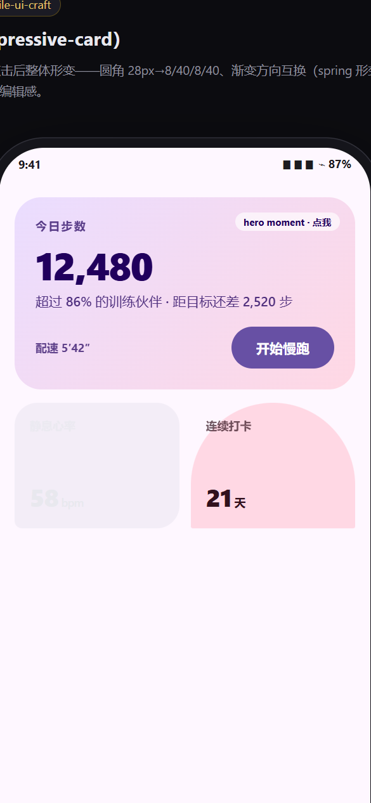
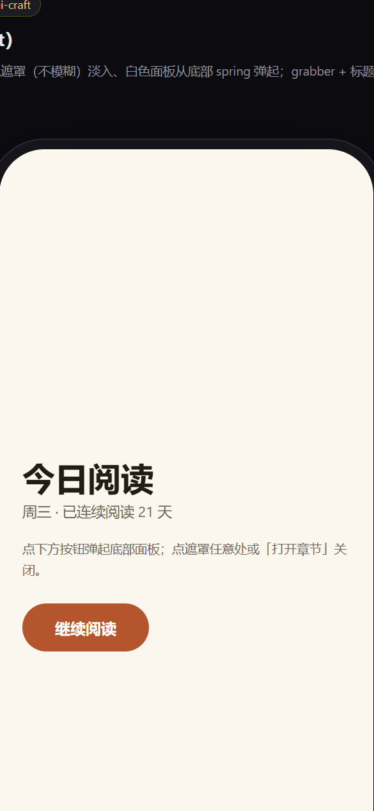
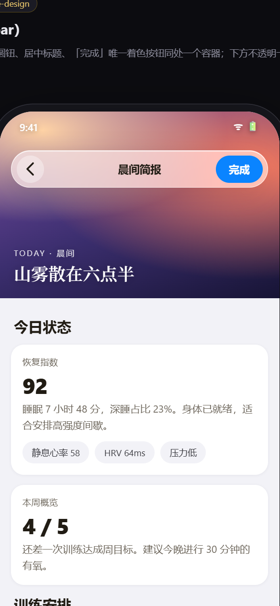

# mobile-design

**三套移动端设计语言的纯静态组件库** —— Material 3 Expressive（Android）、iOS 原生 UI、iOS 26 Liquid Glass。

纯 HTML/CSS/JS，**零构建、零依赖、无需服务器**：双击任意 `index.html` 就能在浏览器里看效果（`file://` 直接可用）。

| Android · Material 3 Expressive | iOS · 原生（无玻璃） | iOS 26 · Liquid Glass |
| :---: | :---: | :---: |
|  |  |  |

## 为什么是这三个

- **Material 3 Expressive**：弹簧动效（spatial 回弹 / effects 临界阻尼双轨）、35 种形状、48 色角色、强调字重排版、新组件替换（ButtonGroup、FloatingActionButtonMenu、形状形变装载器）。
- **iOS 原生**：HIG 骨架——大标题、inset grouped 列表、内嵌分隔线、实心栏 + 发丝线、单一强调色。刻意**全程 0 个 `backdrop-filter`**。
- **Liquid Glass**：两层纪律（玻璃只属于浮在内容上的控件层，内容层永远不透明）、Regular/Clear 变体、35% 压暗层、scroll-edge 渐隐带、滚动最小化 Tab 条、Reduce Transparency 不透明回退。

## 快速开始

```bash
git clone <this-repo>
```

双击 `index.html` 打开组件总览，点任意卡片进入单组件 demo。或部署到任意静态托管（GitHub Pages 直接可用）。

## 组件清单

### `components/android-m3/` — 6 个

| 组件 | 说明 |
|---|---|
| `spring-switch` | M3 开关：knob 弹簧位移、轨道色临界阻尼不回弹 |
| `button-group` | 连接式分段按钮（替代 SegmentedButton） |
| `fab-menu` | 圆角方块 FAB 展开为弹簧菜单（替代堆叠小 FAB） |
| `morph-loader` | 形状形变装载器（替代圆形 spinner） |
| `nav-pill-bar` | 底部导航 + 弹射平移的胶囊指示器 |
| `expressive-card` | Hero moment 卡片：形变 + 色移 + 强调字重同帧联动 |

### `components/ios-native/` — 6 个

| 组件 | 说明 |
|---|---|
| `large-title-header` | 状态栏 + 导航行 + 34pt 大标题 |
| `segmented-control` | 白色 thumb 弹性滑动的分段控件 |
| `ios-switch` | 51×31 系统绿开关 |
| `inset-grouped-list` | 圆角分组卡 + 图标方块 + 57px 内嵌分隔线 |
| `tab-bar-solid` | 实心 Tab 栏（非玻璃的正确画法） |
| `bottom-sheet` | 从触发处弹起的实心面板 + 纯色遮罩 |

### `components/liquid-glass/` — 5 个

| 组件 | 说明 |
|---|---|
| `glass-toolbar` | 浮动玻璃工具条，唯一着色按钮；含 Reduce Transparency / 反例演示开关 |
| `glass-tab-bar` | 玻璃底栏，向下滚动最小化、回滚展开 |
| `glass-fab` | 玻璃圆形操作钮 |
| `clear-variant-bar` | 压在照片上的 Clear 玻璃 + 35% 压暗层 |
| `scroll-edge` | 内容撞向玻璃条时的渐隐带 |

## 项目结构

```
mobile-design/
├── index.html                 # 组件总览
├── shared/
│   ├── tokens.css             # 设计 token：弹簧曲线、M3 角色色、iOS 调色、Glass 配方
│   ├── frame.css              # demo 页舞台（手机外壳 + 说明栏）
│   └── glass.css              # 玻璃基础类（Regular/Clear/35% 压暗/无障碍回退）
├── components/
│   ├── android-m3/<name>/     # index.html + style.css (+ script.js)
│   ├── ios-native/<name>/
│   └── liquid-glass/<name>/
└── docs/screenshots/
```

**每个组件一个目录、一个 demo 页**：组件的样式与行为只依赖自己的 `style.css`/`script.js` 和 `shared/` 三个文件，拷走即用。

## 约定

- **动效双轨**：位移/尺寸/形变走 `--spring`（约 10% 回弹）；颜色/透明度走 `--damped`（临界阻尼，绝不回弹）。
- **无障碍**：`shared/tokens.css` 内置 `prefers-reduced-motion` 降级；Liquid Glass 组件支持 `body.reduce-transparency` 不透明回退。
- **file:// 安全**：不用 ES modules、不用 `fetch`、不引 CDN——所以没有服务器也能跑。

## 设计依据

设计规则提取自三个开源 Agent Skill，代码为原创实现：

- [hamen/material-3-skill](https://github.com/hamen/material-3-skill)（MIT）— Material 3 token/组件/合规
- [dickwu/apple-design-skill](https://github.com/dickwu/apple-design-skill) — Apple HIG 与 Liquid Glass 规则
- [ivan-magda/mobile-design-skills](https://github.com/ivan-magda/mobile-design-skills)（MIT）— iOS 26 / M3 Expressive 生成工艺与反模式清单

## License

[MIT](LICENSE)
